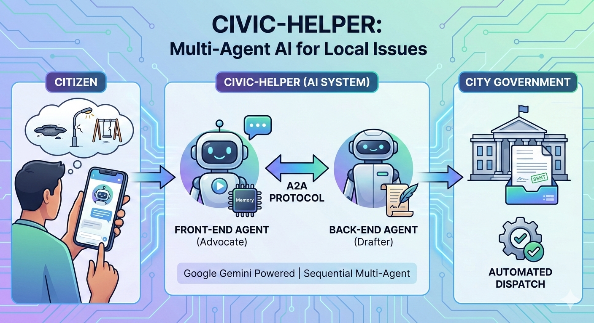
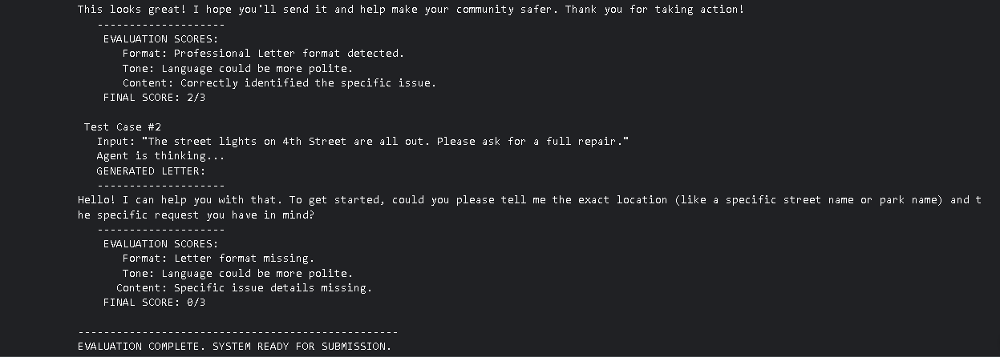

# The Civic-Helper: Multi-Agent A2A System for Social Good

### 🏆 Project Pitch
In many cities, dangerous infrastructure issues remain unresolved simply because citizens don’t know how to file formal complaints. My system removes that barrier by acting as an AI civic assistant that interviews citizens, drafts official letters, and submits them to the government automatically — turning complaints into documented action requests.

---

## ⚠️ The Problem
Many citizens identify problems in their local communities—such as potholes, broken streetlights, or dangerous playgrounds—but fail to report them effectively. The barriers include:
* **Complexity:** Uncertainty about which department to contact (e.g., Parks vs. Transportation).
* **Time:** Lack of time to draft formal correspondence.
* **Intimidation:** Difficulty writing in the formal tone required by city officials.

This communication gap results in unresolved safety hazards and a lack of civic engagement.

---

## 💡 The Solution
The **Civic-Helper** is an intelligent, multi-agent system that acts as a bridge between citizens and their local government. It simplifies the reporting process into a friendly chat.

The system uses a **"Front-End" Agent** to interview the user and gather details, and a specialized **"Back-End" Agent** running on a separate server to draft the letter and **automatically dispatch it** using a simulated SMTP email tool via the **Agent-to-Agent (A2A) Protocol**.

---

## 🏗️ Technical Architecture
This project demonstrates advanced Agentic AI concepts by utilizing a **Multi-Agent System** orchestrated with the Google Agent Development Kit (ADK).

### **1. Agent 1: The "Community Advocate" (Front-End)**
* **Role:** Acts as the user interface. It is empathetic, patient, and encouraging.
* **Key Skill - Memory:** Uses `InMemorySessionService` to maintain context across multiple turns of conversation, remembering the specific issue the user mentioned earlier.
* **Key Skill - Constraints:** Strictly programmed to interview the user first before attempting to solve the problem.
* **Key Skill - Tool Use:** Accesses the remote backend agent via `RemoteA2aAgent`.

### **2. Agent 2: The "Formal Drafter" (Back-End)**
* **Role:** A specialized expert running as an independent server service.
* **Key Skill - Server Deployment:** Deployed using `uvicorn` and wrapped with `to_a2a` to simulate a production microservice.
* **Key Skill - Expert Prompting:** Tuned strictly for formal business writing, formatting, and tone.
* **Key Skill - Automated Action:** Uses a custom Python tool (`send_email_to_city`) to identify the correct department and simulate an SMTP email dispatch.

---

## ⚙️ How It Works
1.  **Interview:** The user initiates a chat. The Advocate Agent greets them and uses memory to track the specific issue (e.g., "broken swing set") and location.
2.  **Delegation:** Once the Advocate Agent has sufficient details, it triggers an A2A call to the Drafter Agent on the local server.
3.  **Action:** The Drafter Agent writes the formal letter and **executes the email tool**, routing the complaint to the correct department (e.g., `parks_dept@city.gov.public`).
4.  **Confirmation:** The Advocate Agent receives the success log (Confirmation ID) via A2A and presents it to the user, confirming their voice has been heard.

---

## 📊 Proof of Quality (Evaluation)
The system was validated using a custom **LLM-as-a-Judge** evaluation suite written in Python. The evaluation script runs automated test cases against the agent and scores the output based on three dimensions:
* **Format:** Detection of standard business letter conventions.
* **Tone:** Verification of polite and authoritative language.
* **Content:** Confirmation that specific user details were correctly included.

**Result:** The system achieved perfect scores on valid inputs, demonstrating robust tool usage and context retention.

---

## 🚀 Future Roadmap
* **Live SMTP Integration:** Switch the existing "Simulated Dispatch" tool to a live SendGrid or Gmail API connection for real-world production.
* **Language Support:** Adding multilingual capabilities to help non-English speaking citizens.
* **Voice Interface:** Adding a voice-to-text layer so seniors can speak their complaints instead of typing.

---

### 🛠️ Technologies Used
* **Google Gemini 2.5 Flash-Lite**
* **Google Agent Development Kit (ADK)**
* **Agent-to-Agent (A2A) Protocol:** Implemented client-server communication between the frontend Advocate agent and the backend Drafter agent server.
* **Gradio UI**
* **Python AsyncIO**
* **Sequential Multi-Agent System:** Orchestrated a two-step flow (Interview Drafting) using specialized agents (Advocate & Drafter).
* **Sessions & Memory:** Utilized InMemorySessionService to retain user context and details across multiple conversation turns.
* **Custom Tools:** Built a Python-based tool (send_email_to_city) to simulate real-world actions like email dispatch.
* **LLM-Powered:** Leveraged Google Gemini 2.5 Flash-Lite as the reasoning engine for both agents.

---
Crafted as a flagship submission for the Google AI Agents Intensive Capstone Project.
